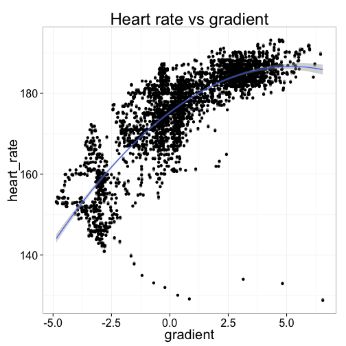
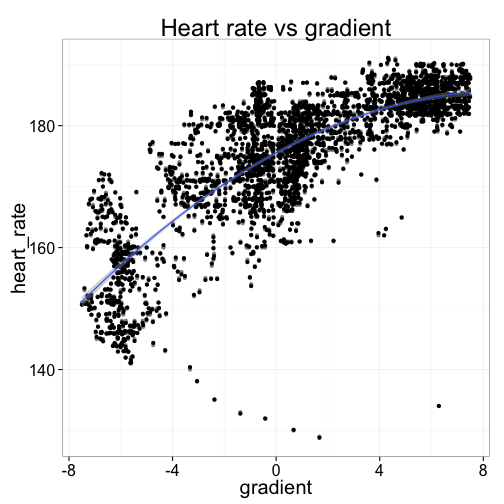
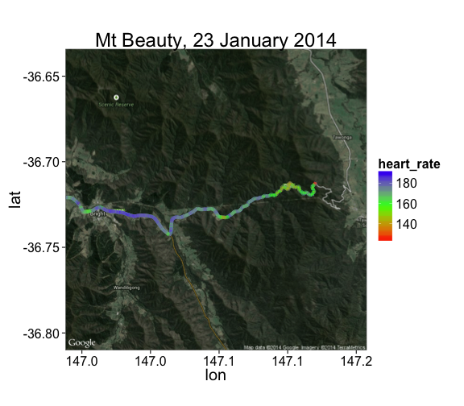

ANT+ FIT file decoder for R
===========================


Reads FIT exercise files from a Garmin or other ANT+ devices into R. Developed for a Garmin Edge 500, but likely to work with other devices, too.

This package incorporates code from the [ANT+ FIT SDK](http://www.thisisant.com/resources/fit).

Install
-------

Download the source package, then run:
```R
install.packages('fit_0.1.tar.gz')
```
The package depends on `Rcpp`, and will have to compile the ANT+ SDK sources (included in the package).

Getting started
---------------

The FIT protocol organises data in a series of 'messages' of different types.
Examples are exercise sessions, and laps. The fit package provides one data.frame
per message type.

First you have to extract the file from the GPS device. On my Garmin Edge 500, the files can be found by plugging it in to the USB port, and opening the `Garmin/Activities` folder that appears on the USB device.

Here's an example GPS file, from a ride to Mt Beauty in Victoria, Australia:

```r
library(fit)
data <- read.fit('examples/mt_beauty.fit')
names(data)
```

```
## [1] "file_id"      "session"      "lap"          "record"       "event"        "device_info"  "activity"     "file_creator"
## [9] "unknown"
```
The names of the available data tables can be found using `names()`. My device records exercise progress as `record` messages every few seconds, so we're interested in the `record` table:

```r
head(data$record)
```

```
##   altitude cadence distance heart_rate position_lat position_long speed temperature timestamp
## 1     3839      78      874        159       -36.72         146.9  8739          31 759393569
## 2     3839      78     3420        162       -36.72         146.9  8465          31 759393572
## 3     3839      80     5987        164       -36.72         146.9  8634          31 759393575
## 4     3839      82    10436        167       -36.72         146.9  8994          31 759393580
## 5     3837      82    12235        167       -36.72         146.9  9032          31 759393582
## 6     3837      82    13134        167       -36.72         146.9  8994          31 759393583
```

The table contais data like GPS coordinates (latitude, longitude, altitude), cadence, heart rate, speed 
and distance travelled, depending on which gadgets you have attached to your device. If you have a power
meter, that data will show up here, too. 

The units for each field are available in the table's 'units' attribute. 

```r
attr(data$record,'units')
```

```
## [1] "m"       "rpm"     "m"       "bpm"     "degrees" "degrees" "m/s"     "C"       "s"
```

The timestamp, given in seconds, is the time elapsed since Jan 1, 1990. You might want to subtract the first value in the table, which would give you the number of seconds elapsed in your session.

Example analysis
----------------
Here's a plot of my elevation, in meters, as a function of the number of minutes I was riding. (It was a fairly decent hill!)

```r
library(ggplot2)
pdata <- with(data$record, data.frame(alt = altitude*0.1, time = (timestamp-timestamp[1])/60))
ggplot(pdata, aes(y=alt, x=time)) + geom_line() +
  ggtitle("Elevation vs Time") + xlab("time (minutes)") + ylab("elevation (m)")
```

 

Now let's try to answer a more interesting question: how much harder does my heart work when I'm riding uphill?

We can compute the average gradient using the familiar formula, 
$$\text{gradient} = \frac{\text{change in elevation}}{\text{distance travelled}}.$$ 
The elevation readings are pretty noisy and only measured in whole meters, so I'll smooth the gradients by averaging over 10 observations, which is about 30-40 seconds of riding. (We can do better than averaging, using a Kalman filter, but that's probably overkill for now.)

As we might expect, the relationship is upward sloping: the steeper the hill, the faster my heart is working. Travelling down hill (negative gradient) is the easiest, and my heart is usually beating 150-170 beats per minute. But uphill, my heart can be doing anything from 170 to 205 or so when it's really steep. (Ouch!) And what's really interesting is that the relationship is non-linear: as the road gets steeper, the increase in heart rate diminishes. This is probably because there's only so hard my heart can actually beat---and rather than suffer cardiac arrest, I slow the bike down a bit and let my heart muscle rest.

```r
pdata <- data$record[-(1:10),c("heart_rate","timestamp")]
# compute average gradient, as %
pdata$gradient <- with(data$record, 100 * diff(altitude * 0.1,lag=10) / diff(distance * 0.01,lag=10))
pdata <- subset(pdata, complete.cases(pdata) & abs(gradient) < 7.5 & gradient != 0) # drop outliers
ggplot(pdata, aes(x=gradient, y=heart_rate)) + 
  geom_point(alpha=0.5) + geom_jitter() +
  stat_smooth(method="lm", formula=y ~ poly(x, 2)) +
  ggtitle("Heart rate vs gradient")
```

 

Making maps
-----------
Since we have GPS data, it'd be a shame not to plot the data on a map. One way to do this is to use David Kahle and Hadley Wickham's excellent `ggmap` package.

In the map below, we get a map image from Google Maps, and overlay the path I travelled, using my heart rate again for the colour.

```r
library(ggmap)

garmin.data <- read.fit('examples/mt_beauty.fit')
points <- subset(garmin.data$record, complete.cases(garmin.data$record))

map <- get_googlemap(center = colMeans(points[,c('position_long','position_lat')]),
                     zoom = 12, size=c(640,480), maptype = c("hybrid"))

ggmap(map) +
  geom_path(aes(x = position_long, y = position_lat, colour = heart_rate),
             data = points, size = 3) +
  scale_colour_gradientn(colours = rainbow(3)) +
  ggtitle("Mt Beauty, 23 January 2014")
```

 

The GPS coordinates are suprisingly accurate. We discussed above that the altitude data is fairly noisy, although this is mostly because altitudes are given as integers, and there isn't much vertical movement when you ride. This means that round-off error is large compared to actual vertical movement, and so contributes a lot to the signal-to-noise ratio.

Check out this excerpt of my daily commute, which runs along the bike path on the western side of the Sydney Harbour Bridge. The GPS path tracks the bike path almost exactly the whole way:

```r
load('examples/commute.rda') # subset of a daily commute (R data format)
map <- get_googlemap(center = c(151.210787,-33.852306), zoom = 16, maptype = c("satellite")) # Harbour Bridge
ggmap(map, extent = "device") +
  geom_path(aes(x = position_long, y = position_lat),
             data = commute, size = 1, colour = 'blue')
```

 
